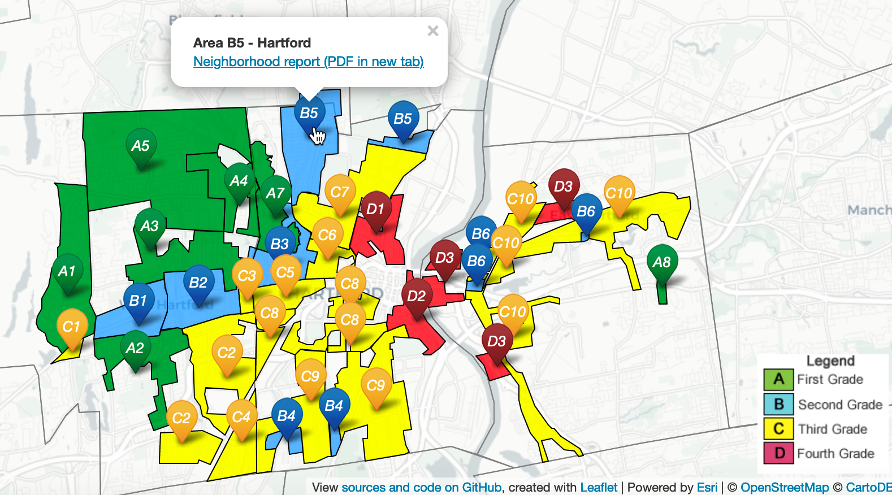

# Image testing {#Image}

Note that auto_pdf is true in global options

## Image table {- #image-table}

Method 1: create uniform 150x150 at 300dpi JPG (not PNG) images; use colon to left-justify, and hyphens to set relative width (2 vs. 10)

|  | Group 1 |
| :-- | :---------- |
|  | Cupcake ipsum dolor sit amet danish. Chocolate cake muffin oat cake pie. Cookie pastry bonbon I love candy canes wafer tart I love chocolate bar. Toffee candy canes croissant lemon drops jelly-o sesame snaps. Cake gummies apple pie bonbon jelly beans cotton candy I love bonbon. Jujubes tart icing ice cream chocolate bar cake oat cake lemon drops jelly-o.|
|  | Group 2 |
|  | Cupcake ipsum dolor sit amet danish. Chocolate cake muffin oat cake pie. Cookie pastry bonbon I love candy canes wafer tart I love chocolate bar. Toffee candy canes croissant lemon drops jelly-o sesame snaps. Cake gummies apple pie bonbon jelly beans cotton candy I love bonbon. Jujubes tart icing ice cream chocolate bar cake oat cake lemon drops jelly-o. |
|  | Cupcake ipsum dolor sit amet danish. Chocolate cake muffin oat cake pie. Cookie pastry bonbon I love candy canes wafer tart I love chocolate bar. Toffee candy canes croissant lemon drops jelly-o sesame snaps. Cake gummies apple pie bonbon jelly beans cotton candy I love bonbon. Jujubes tart icing ice cream chocolate bar cake oat cake lemon drops jelly-o. |

Method 2: start with large originals when possible, create uniform 150x150 at 300dpi PNG (not JPG) images, and the rest is the same as above

|  | Group 1 |
| :-- | :---------- |
|  | Cupcake ipsum dolor sit amet danish. Chocolate cake muffin oat cake pie. Cookie pastry bonbon I love candy canes wafer tart I love chocolate bar. Toffee candy canes croissant lemon drops jelly-o sesame snaps. Cake gummies apple pie bonbon jelly beans cotton candy I love bonbon. Jujubes tart icing ice cream chocolate bar cake oat cake lemon drops jelly-o.|
|  | Group 2 |
|  | Cupcake ipsum dolor sit amet danish. Chocolate cake muffin oat cake pie. Cookie pastry bonbon I love candy canes wafer tart I love chocolate bar. Toffee candy canes croissant lemon drops jelly-o sesame snaps. Cake gummies apple pie bonbon jelly beans cotton candy I love bonbon. Jujubes tart icing ice cream chocolate bar cake oat cake lemon drops jelly-o. |
|  | Cupcake ipsum dolor sit amet danish. Chocolate cake muffin oat cake pie. Cookie pastry bonbon I love candy canes wafer tart I love chocolate bar. Toffee candy canes croissant lemon drops jelly-o sesame snaps. Cake gummies apple pie bonbon jelly beans cotton candy I love bonbon. Jujubes tart icing ice cream chocolate bar cake oat cake lemon drops jelly-o. |

Lorem ipsum dolor sit amet, consectetur adipisicing elit, sed do eiusmod tempor incididunt ut labore et dolore magna aliqua. Ut enim ad minim veniam, quis nostrud exercitation ullamco laboris nisi ut aliquip ex ea commodo consequat. Duis aute irure dolor in reprehenderit in voluptate velit esse cillum dolore eu fugiat nulla pariatur. Excepteur sint occaecat cupidatat non proident, sunt in culpa qui officia deserunt mollit anim id est laborum.


### Sample static PNG image in all editions, no interactive version {-}
(ref:sample-static-png) Use large original PNG sample static image, use out.width to reduce for web edition. Create smaller auto_pdf for PDF edition. Option to add *Markdown* formatting, [links](http://google.com), but NO footnotes in captions due to PDF edition errors.

```{r sample-static-png, out.width=500, fig.cap="(ref:sample-static-png)"}
 
```

### Sample static PNG image2 175k version {-}
(ref:sample-static-png2) Original PNG sample static image, no reduction for web edition, but create smaller 400 wide 300dpi auto_pdf for PDF edition.

```{r sample-static-png2, fig.cap="(ref:sample-static-png2)"}
 
```

### Sample static PNG image 2MB version {-}
(ref:sample-static-png3) Original PNG sample from closeup screenshot, no reduction for web edition, but create smaller 400 wide 300dpi auto_pdf for PDF edition.

```{r sample-static-png3, fig.cap="(ref:sample-static-png3)"}
 
```


### Interactive iframe (adj height) in web edition, auto_pdf 300dpi image in PDF edition  {-}
(ref:sample-interactive) Caption for all versions here, with link to [full-screen interactive map with its own caption](https://ontheline.github.io/otl-redlining/index-caption.html), and link to sources and the code  View [map historical sources, known issues, and the code](https://github.com/ontheline/otl-redlining/), developed by Ilya Ilyankou and Jack Dougherty.

```{r sample-interactive, fig.cap="(ref:sample-interactive)"}
if(knitr::is_html_output(excludes="markdown")) knitr::include_url("https://ontheline.github.io/otl-redlining/") else 
```
