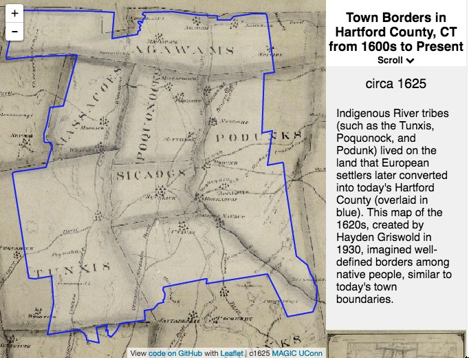
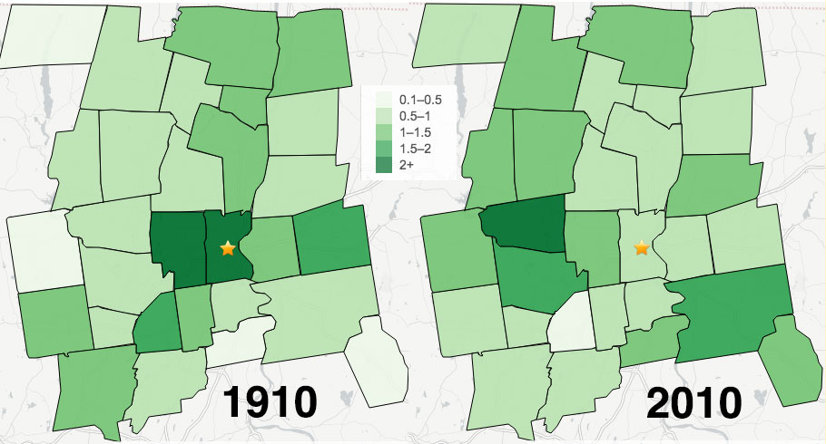
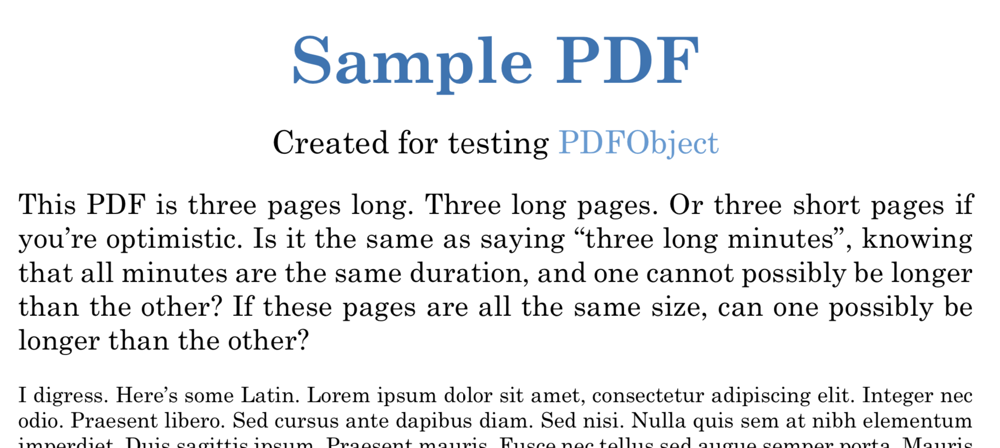

# Chapter 1 with interactive media tests

Small changes and more small changes. And more small changes. Lorem ipsum dolor sit amet, consectetur adipisicing elit, sed do eiusmod tempor incididunt ut labore et dolore magna aliqua. Ut enim ad minim veniam, quis nostrud exercitation ullamco laboris nisi ut aliquip ex ea commodo consequat. Duis aute irure dolor in reprehenderit in voluptate velit esse cillum dolore eu fugiat nulla pariatur. Excepteur sint occaecat cupidatat non proident, sunt in culpa qui officia deserunt mollit anim id est laborum.[@tegelerFindingCommonGround2011]


#### Display interactive content in HTML with screenshot in PDF {-}
- First, define a text reference for each caption, because it accepts RMarkdown cites and links. See [Bookdown section 2.2.4](https://bookdown.org/yihui/bookdown/markdown-extensions-by-bookdown.html)
- Second, insert the figure with an R code chunk <https://bookdown.org/yihui/bookdown/r-code.html>, using the if-then-else statement from Michael Dorman, to display interactive version in HTML and static version in PDF.
- Optional: In the body text, insert a dynamic reference to the figure (which due to floating images in PDF engines, may appear on a different page), like this: ... as shown in Figure \@ref(fig:otl-town-borders).

(ref:otl-town-borders) Scroll down the narrative (or click and use arrow keys) in this [interactive map](https://ontheline.github.io/otl-town-borders/) to see how Hartford County, Connecticut was divided into 29 separate towns from the early 1600s to the late 1800s. Boundaries shown here are not exact, but approximated from the best available digital sources: UConn Libraries MAGIC historical maps, Atlas of Historical County Boundaries at Newberry Library, and the Connecticut State Register and Manual. View [map historical sources, known issues, and the code](https://github.com/ontheline/otl-town-borders/), developed by Ilya Ilyankou and Jack Dougherty.^[@ilyankouMapTownBorders2017]

```{r otl-town-borders, echo=FALSE, fig.cap="(ref:otl-town-borders)", fig_height=9, screenshot.alt="images/1600s-otl-town-borders.jpg"}
if(knitr::is_html_output()) knitr::include_url("https://ontheline.github.io/otl-town-borders/") else 
```

Here's a second type of interactive map, adding in auto.pdf=TRUE:

(ref:otl-home-value) Here's a sample caption

```{r otl-home-value, echo=FALSE, fig_height=10, fig.cap="(ref:otl-home-value)", auto.pdf=TRUE, screenshot.alt="images/1910-2010-home-value.jpg"}
if(knitr::is_html_output()) knitr::include_url("https://ontheline.github.io/otl-home-value/") else 
```

UNANSWERED QUESTIONS:

1. How can I increase the height of the map in the dynamic HTML edition? The HTML rendered iframe is stuck at height=400px, no matter what I try. None of these settings in the example above affect the HTML output:
  + fig.height=9 (default is 7)
  + fig_height=9 (I tried both of these versions)
  + out.height="600px"
  + out.height="150%"
2. How can I insert a title to appear immediately above the map, in both the dynamic HTML and static PDF editions? I know that I can insert a paste () command in the code block, immediately after the curly bracket } and before the if (knitr) statement, but it is ugly and I have no formatting control.
3. To do later: modify style.css p.caption for PDF to make underscored links visible in captions, to allow easy click to HTML version


TESTING VIDEO IN BOOKDOWN:

(ref:vimeo-sample-video) Here's a sample Vimeo caption, with option to add Markdown link and footnote.

```{r vimeo-sample-vimeo, echo=FALSE, fig.cap="(ref:vimeo-sample-video)", auto.pdf=TRUE, screenshot.alt="images/2011-walsh-debra.jpg"}
if(knitr::is_html_output()) knitr::include_url("https://player.vimeo.com/video/27299734") else 
```

(ref:youtube-sample-video) Here's a sample YouTube caption, with option to add Markdown link and footnote.

```{r youtube-sample-video, echo=FALSE, fig.cap="(ref:youtube-sample-video)", auto.pdf=TRUE, screenshot.alt="images/2013-cthistory-video-screenshot.png"}
if(knitr::is_html_output()) knitr::include_url("https://www.youtube.com/embed/NuWg9Jrkrpw?start=64") else knitr::include_graphics("images/2013-cthistory-video-screenshot.png")
```

(ref:ctda-sample-video) Here's a sample CTDA video caption, with option to add Markdown link and footnote.

```{r ctda-sample-video, echo=FALSE, fig.cap="(ref:ctda-sample-video)", auto.pdf=TRUE, screenshot.alt="images/2014-lumpkin-mae-willie-screenshot.png"}
if(knitr::is_html_output()) knitr::include_url("https://collections.ctdigitalarchive.org/islandora/object/120002%3A221/datastream/MP4/view") else knitr::include_graphics("images/2014-lumpkin-mae-willie-screenshot.png")
```

(ref:kaltura-sample-video) Here's a sample Kaltura video caption, with option to add Markdown link and footnote.

```{r kaltura-sample-video, echo=FALSE, fig.cap="(ref:kaltura-sample-video)", auto.pdf=TRUE, screenshot.alt="images/2006-hartford-profiles-1.png"}
if(knitr::is_html_output()) knitr::include_url("https://cdnapisec.kaltura.com/html5/html5lib/v2.76/mwEmbedFrame.php/p/2366381/uiconf_id/42684261/entry_id/1_1jk9ch6s?wid=_2366381&iframeembed=true&playerId=kaltura_player&entry_id=1_1jk9ch6s") else 
```

(ref:pdf-sample-local) Here's a sample local scrollable PDF caption, with option to add Markdown link and footnote.

```{r pdf-sample-local, echo=FALSE, fig.cap="(ref:pdf-sample-local)", auto.pdf=TRUE, screenshot.alt="images/sample-3pp.pdf"}
if(knitr::is_html_output()) knitr::include_url("images/sample-3pp.pdf") else 
```

References:

- R Markdown book section on figures https://bookdown.org/yihui/rmarkdown/html-document.html#figure-options
- R Markdown reference https://www.rstudio.com/wp-content/uploads/2015/03/rmarkdown-reference.pdf
- On R code chunks in RMarkdown https://bookdown.org/yihui/rmarkdown/r-code.html
- On R code options in knitr package https://yihui.name/knitr/options
- Tips and tricks http://zevross.com/blog/2017/06/19/tips-and-tricks-for-working-with-images-and-figures-in-r-markdown-documents/#arguments-out.width-and-out.height-apply-to-both-existing-images-and-r-generated-figures
