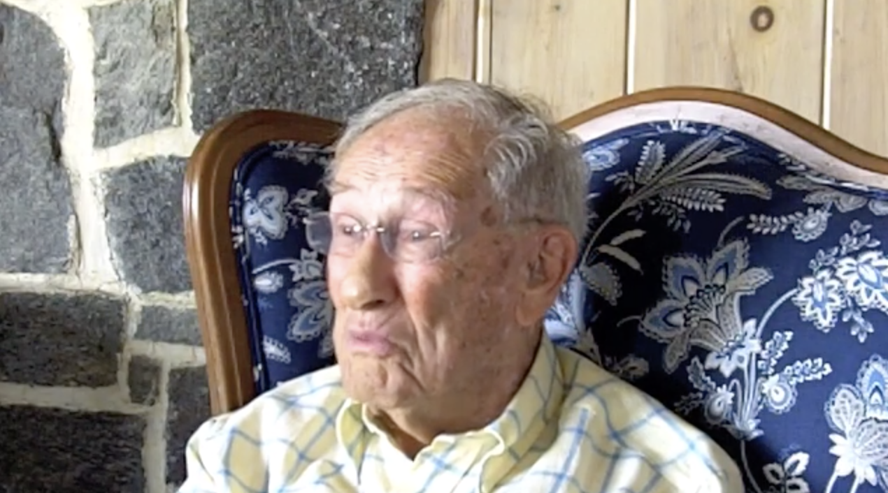

# Video Tests {#video}

Problem: Video stream content from CT Digital Archives and Trinity Kaltura automatically runs in autoplay mode in web browsers, and I have not yet found a consistent way to block this from happening.

**BEFORE TESTING**: TEST in both Firefox and Chrome for auto-play issue. Make sure that your browser settings do NOT block autoplay content by default, since we cannot ensure that users will have same browser settings as developers.

##### Best solution so far: Upload relevant clip to YouTube to display as iframe in web edition, with static image in PDF/Word editions, with caption link and footnote to full video, uploaded for historical preservation to CTDA or Kaltura {-}
(ref:youtube-sample-video) Here's a sample YouTube caption, with option to add Markdown links and footnote to full video at CTDA.

```{r youtube-sample-video, echo=FALSE, fig.cap="(ref:youtube-sample-video)"}
if(knitr::is_html_output()) knitr::include_url("https://www.youtube.com/embed/NuWg9Jrkrpw?start=64") else 
```

#### Issue Background {-}
Here is an oral history video as displayed on the CTDA site, which does NOT autoplay:

<https://collections.ctdigitalarchive.org/islandora/object/120002:172>

Here is the CTDA MP4 video stream for that object, which runs AUTOPLAY in Chrome and FFox for Mac (and perhaps other browsers). CTDA says there is no setting to turn off autoplay from datastreams

<https://collections.ctdigitalarchive.org/islandora/object/120002:172/datastream/MP4>

The stream above also works with this "view" ending, but also runs autoplay:

<https://collections.ctdigitalarchive.org/islandora/object/120002:172/datastream/MP4/view>

#### Failed: iframe  with autoplay=false {-}
Here is Bookdown code-chunk that displays CTDA video in web edition, static image in PDF edition, BUT CANNOT TURN OFF AUTOPLAY using the iframe method, even if I add "?autoplay=0" or "?autoplay=false" to the end of the src string, as suggested in Stackoverflow further below.

(ref:ctda-sample-video) Here's a sample CTDA video caption, with option to add Markdown link and footnote.

```{r ctda-sample-video, echo=FALSE, fig.cap="(ref:ctda-sample-video)"}
if(knitr::is_html_output()) knitr::include_url("https://collections.ctdigitalarchive.org/islandora/object/120002:172/datastream/MP4?autoplay=false") else 
```

Also tried but did not succeed in adding a "no autoplay" command to the iframe through jQuery in the custom-script.html


#### Not Bookdown-friendly: HTML5 video tag solution {-}
Here's a solution using the [HTML5 video tag](https://www.w3schools.com/tags/tag_video.asp), which inserts user "controls" but omits "autoplay".

<video controls width="640" height="360">
    <source src="https://collections.ctdigitalarchive.org/islandora/object/120002:191/datastream/MP4" type="video/mp4">
</video>

The HMTL5 video tag solution stops autoplay, but it is NOT ideal for Bookdown-generated books because:

-  Bookdown/knitr does not *appear* to support the HMTL 5 video tag in the same way as it supports knitr::include_url. I could submit a request to Bookdown to support HTML5 video tag, but it's not likely to happen soon....
- This means that I cannot use Bookdown built-in support for figures using the HMTL5 video tag, such as:
  - the if-else statement in the R code-chunk that places the interactive iframe in HTML and the static floating image in the PDF, but the same caption for both
  - figure auto-numbering, such as Figure 1.2, 1.3, etc.

#### Failed: iframe solution with short video clip, stored locally, with custom script - but it autoplays {-}
(ref:sample-clip) Here's a sample local video clip caption, with option to add Markdown link and footnote.

```{r sample-clip, echo=FALSE, fig.cap="(ref:sample-clip)"}
if(knitr::is_html_output()) knitr::include_url("images/2011-bernstein-demo-clip.mp4") else 
```

An alternative method is to store the video locally and display with HTML5 video tags, with a custom-script to stop auto-play. But Bookdown does not recognize HMTL5, so no figure auto-numbering and captions will be displayed, and therefore not ideal, as described above.

#### More resources {-}
See Stackoverflow discussions about HTML iframe, HTML5 video, and autoplay:

https://stackoverflow.com/questions/49256942/how-to-disable-autoplay-video-in-iframe
and
https://stackoverflow.com/questions/31956221/how-to-disable-auto-play-for-local-video-in-iframe

See Google Chrome Developer autoplay policy change in April 2018:

https://developers.google.com/web/updates/2017/09/autoplay-policy-changes

See Firefox Developer note for Video HTML5 autoplay:

https://developer.mozilla.org/en-US/docs/Web/HTML/Element/video
