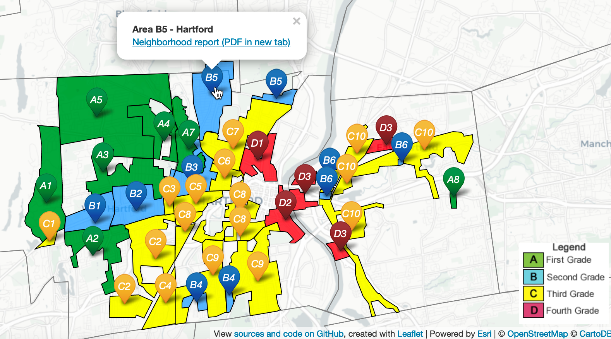

# PDF image testing {#Image}

Note that auto_pdf is true in global options

Lorem ipsum dolor sit amet, consectetur adipisicing elit, sed do eiusmod tempor incididunt ut labore et dolore magna aliqua. Ut enim ad minim veniam, quis nostrud exercitation ullamco laboris nisi ut aliquip ex ea commodo consequat. Duis aute irure dolor in reprehenderit in voluptate velit esse cillum dolore eu fugiat nulla pariatur. Excepteur sint occaecat cupidatat non proident, sunt in culpa qui officia deserunt mollit anim id est laborum.[@tegelerFindingCommonGround2011]


##### Static image in all editions, no interactive version{-}
(ref:sample-static-image) Caption for sample static image, with Markdown formatting, links, citation.

```{r sample-static-image, fig.cap="(ref:sample-static-image)"}
 knitr::include_graphics("images/1937-holc-hartford-map-scan.jpg")
```

Lorem ipsum dolor sit amet, consectetur adipisicing elit, sed do eiusmod tempor incididunt ut labore et dolore magna aliqua. Ut enim ad minim veniam, quis nostrud exercitation ullamco laboris nisi ut aliquip ex ea commodo consequat. Duis aute irure dolor in reprehenderit in voluptate velit esse cillum dolore eu fugiat nulla pariatur. Excepteur sint occaecat cupidatat non proident, sunt in culpa qui officia deserunt mollit anim id est laborum.[@whittenWestHartfordZoning1924]

##### Interactive iframe in web edition (with adjusted height), static image in PDF edition, WITH auto_pdf{-}
(ref:sample-interactive) Caption for all versions here, with link to [full-screen interactive map with its own caption](https://ontheline.github.io/otl-redlining/index-caption.html), and link to sources and the code  View [map historical sources, known issues, and the code](https://github.com/ontheline/otl-redlining/), developed by Ilya Ilyankou and Jack Dougherty, with footnote (if I can get it to work)

<!-- set iframe 600px height 100% width in custom-scripts.html -->
```{r sample-interactive, fig.cap="(ref:sample-interactive)"}
if(knitr::is_html_output()) knitr::include_url("https://ontheline.github.io/otl-redlining/") else 
```
